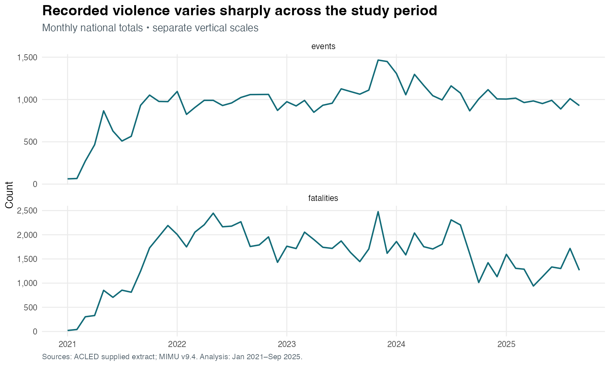
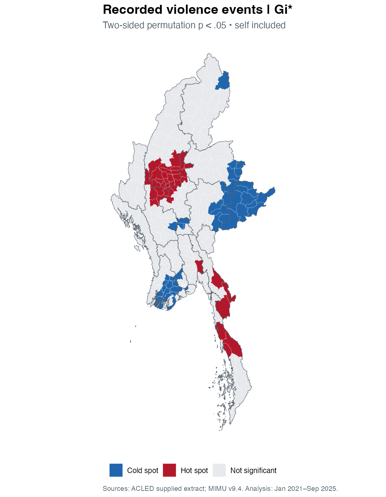
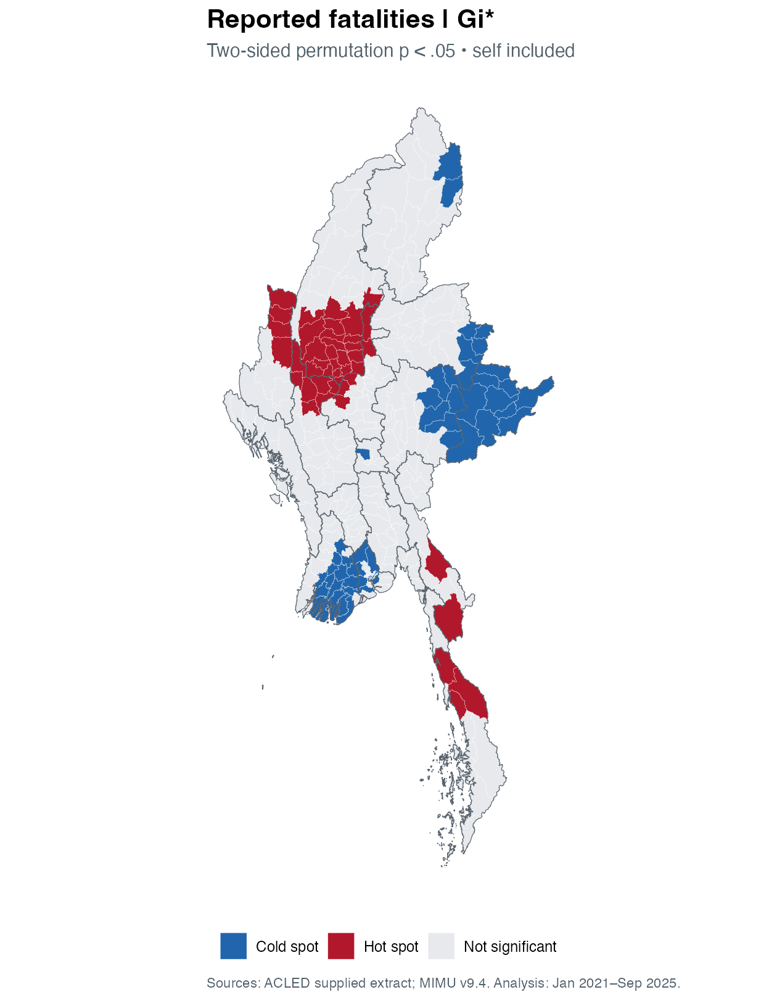
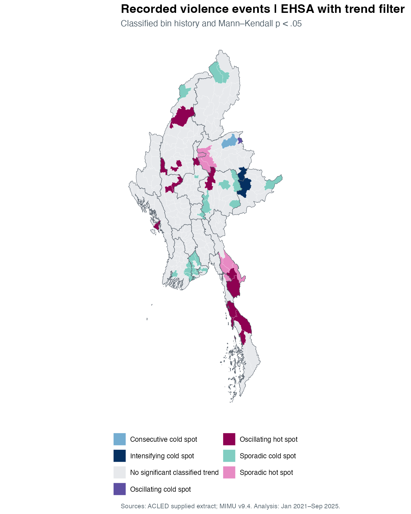
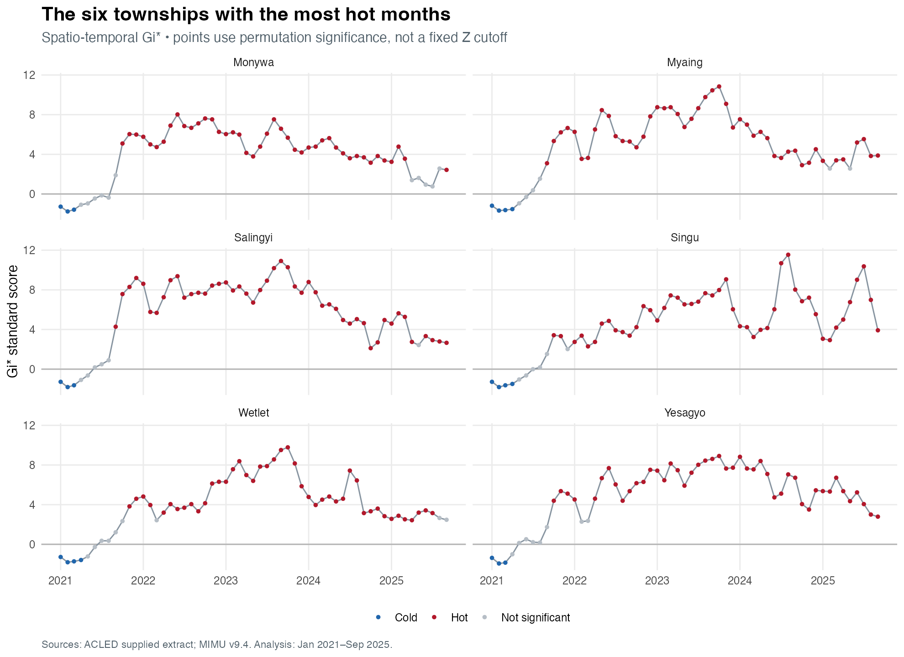
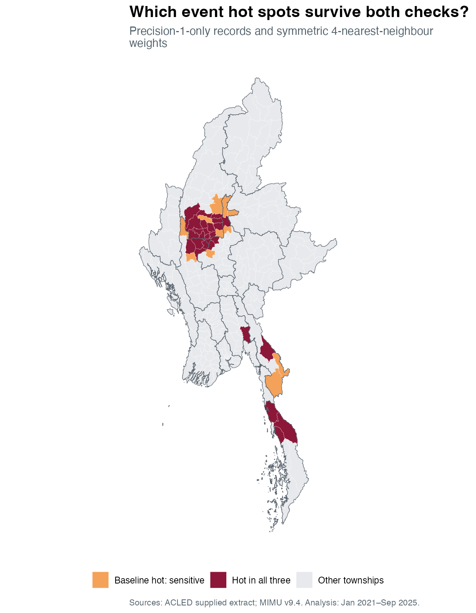
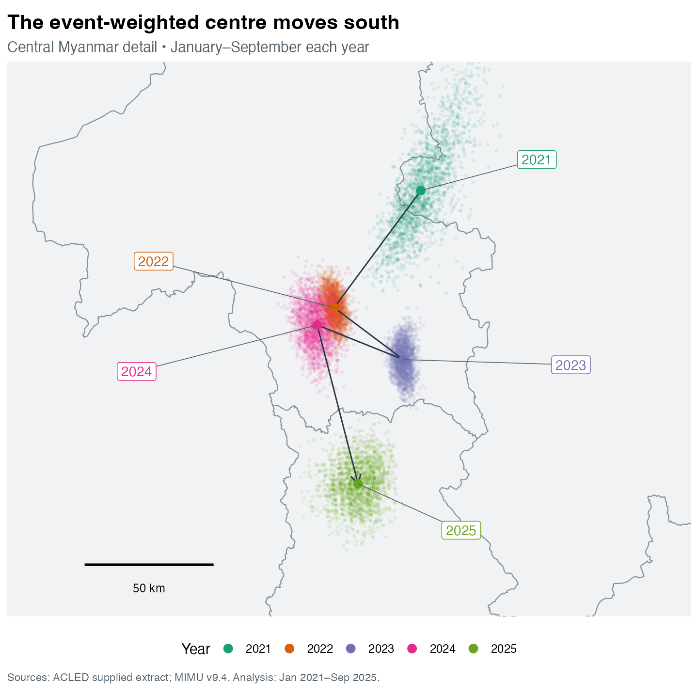

```{r}
#| label: load-verified-results
#| include: false
# Render the technical report first. Slides use its saved, tested outputs.
a <- readRDS("results/analysis.rds")
ee <- read.csv("results/ehsa-events.csv")
ef <- read.csv("results/ehsa-fatalities.csv")
shift <- read.csv("results/centre-shift.csv")
```

## What the analysis asks

Where do high recorded counts cluster, which townships differ from their neighbours, and how do those patterns change?

- **Frequency:** retained violence events.
- **Reported severity:** fatalities attached to those events.
- **Time:** 57 monthly observations per township.

The maps describe recorded burden. They do not estimate individual risk or current conditions.

::: notes
The study uses the period and township geography required by the exercise brief. Raw counts lack a population denominator. Explain this before showing significance maps. Full methods and references are in the technical report.
:::

## From source records to a complete cube

::: columns
::: {.column width="53%"}
**87,109** source records → **53,899** retained events.

330 townships × 57 months = **18,810 bins**.

Three event types: battles, explosions/remote violence, violence against civilians.
:::
::: {.column width="47%"}
Checks cover duplicate IDs, dates, coordinates, fatality values, boundary version and unique spatial matches.

Precision-3 locations are excluded. Eight eligible points lack a unique township match.

Zero bins mean no retained event was recorded.
:::
:::

::: notes
All boundaries have PCode_V 9.4. Six rows are labelled Indian Ocean; the country filter removes them. Geo precision 1 and 2 are retained. Events are counted once. Reported fatalities total 89,005 after these filters, but are not a conflict-mortality estimate. Source: ACLED codebook and MIMU layer linked in the report.
:::

## November 2023 has the largest monthly event count

{height=460}

**1,466 events** in November 2023. Fatality peaks do not always match event peaks.

::: notes
The panels have separate vertical scales. The November 2023 fatality total is 2,477. Avoid comparing full annual totals with the incomplete 2025 year.
:::

## Event hot spots concentrate in several regions

::: columns
::: {.column width="48%"}
{height=565}
:::
::: {.column width="52%"}
**38 hot spots**, including:

- Sagaing: 18
- Mandalay: 7
- Magway: 6

Queen neighbours, self included; two-sided permutation p < .05.

A grey township has insufficient evidence under this test. It is not necessarily safe.
:::
:::

::: notes
Static totals use 9,999 conditional permutations. Gi* identifies local concentration. Local Moran separately finds 36 high–high, 50 low–low and three low–high townships. Hlaingbwe, Seikphyu and Pyinoolwin are the low–high outliers. The technical report contains those maps and multiplicity checks.
:::

## Fatality concentrations differ from event frequency

::: columns
::: {.column width="48%"}
{height=565}
:::
::: {.column width="52%"}
**43 reported-fatality hot spots.**

Chin contains four, but no event-count hot spot under the same specification.

Kale has the highest retained fatality total: **1,877**.

Reported totals have measurement uncertainty and can be influenced by severe incidents.
:::
:::

::: notes
This difference supports examining the measures separately. Neither map is population adjusted. Fatalities and counts are based on the same underlying records, so agreement is not independent validation.
:::

## Emerging patterns need both space and time

::: columns
::: {.column width="48%"}
{height=570}
:::
::: {.column width="52%"}
Each bin uses its township and neighbours at **t and t−1**.

Gi* → monthly history → Mann–Kendall trend → EHSA class.

`r sum(ee$mk_p<.05 & ee$classification!="No pattern detected")` townships have a recognised event history and p < .05 for the trend.

The full-history maps also retain patterns without a significant trend.
:::
:::

::: notes
The full 18,810-bin cube is the reference population. January has no prior month. Classification uses unadjusted bin p < .05 from 999 permutations; the displayed map additionally filters trend p < .05. Overlapping windows and serial dependence limit the usual Mann–Kendall p-values. The R timing rules are documented; this is not claimed as an exact ArcGIS replication.
:::

## A single label can hide many hot months

{height=510}

**Wetlet: 44 hot months**, yet no named endpoint pattern. Read the history beside the label.

::: notes
Salingyi has 48 hot months; Myaing and Singu have 47 each. At least 52 months are needed for the 90% persistence rule. No pattern detected does not mean no sustained burden. Trend slopes and tau are in the report.
:::

## Twenty-seven hot spots survive both checks

::: columns
::: {.column width="48%"}
{height=565}
:::
::: {.column width="52%"}
Starting with **38** event hot spots:

- **35** remain using precision-1 records only.
- **28** remain using symmetric four-nearest neighbours.
- **27** remain under both choices.

Eleven baseline hot spots depend on at least one tested assumption.
:::
:::

::: notes
This is classification agreement, not a probability of correctness. The precision-only sample changes reporting composition. Nearest-neighbour weights change the local comparison group. Multiple-testing correction is a separate check in the report.
:::

## The centre shifts mainly south

::: columns
::: {.column width="48%"}
{height=560}
:::
::: {.column width="52%"}
Comparable **January–September** windows.

2021 → 2025 displacement: **`r round(shift$distance_km)` km**.

About `r round(abs(shift$dy_km))` km south and `r round(abs(shift$dx_km))` km west in the study projection.

Month-resampling range: **`r round(shift$boot_low)`–`r round(shift$boot_high)` km**.

This describes the spatial balance of recorded events, not a moving front.
:::
:::

::: notes
The extension uses event-weighted polygon centroids. It resamples nine whole monthly spatial fields, 1,999 times within each year. Month exchangeability is a limitation. The sensitivity range excludes uncertainty from under-reporting, geocoding and boundary choice. A centre can lie in a low-count location between distant concentrations.
:::

## Use the maps to guide further review

Start with the **27 robust event hot spots**, then assess local needs and reported severity.

- Check sensitive classifications against better location information.
- Keep historical burden separate from present conditions.
- Do not treat cold spots as places with no need.
- Trend tests are exploratory: reporting, multiplicity and serial dependence matter.

[Technical report](Take-home_Ex02.html) · [ACLED definitions](https://acleddata.com/methodology/acled-codebook) · [MIMU boundaries](https://geonode.themimu.info/layers/geonode%3Ammr_polbnda_adm3_250k_mimu_1)

::: notes
This is the tenth substantive slide. The title slide is additional. The technical report contains sources, code, full maps, FDR checks and reproducibility instructions. No analysis here supports operational deployment, present-day travel advice or causal claims about conflict drivers.
:::
